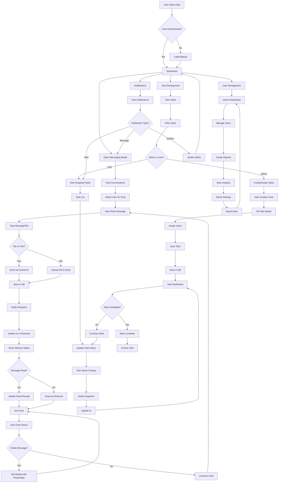

# Task Manager Application

A full-stack task management application built with the MERN stack (MongoDB, Express.js, React, Node.js) with real-time messaging capabilities.

## Table of Contents
- [Features](#features)
- [Messaging System](#messaging-system)
- [Chat Workflow](#chat-workflow)
- [Chat Functioning](#chat-functioning)
- [Flow Diagram](#flow-diagram)
- [Technologies Used](#technologies-used)
- [Project Structure](#project-structure)
- [Getting Started](#getting-started)
  - [Prerequisites](#prerequisites)
  - [Installation](#installation)
- [Environment Variables](#environment-variables)
- [Running the Application](#running-the-application)
- [Building for Production](#building-for-production)
- [Contributing](#contributing)
- [License](#license)

## Features

- User authentication (login/signup)
- Role-based access control (Admin/User)
- Create, read, update, and delete tasks
- Assign tasks to users
- Task status tracking
- User management (Admin only)
- Reporting and analytics

## Messaging System

- Real-time direct messaging between users
- Personal chat functionality with online status tracking
- Message history and conversation threading
- File attachment support (up to 10MB)
- Message read receipts and delivery status
- Soft message deletion with placeholder display
- Conversation list with unread message indicators
- Typing indicators for real-time communication
- Message search and filtering capabilities
- Notification system for new messages
- Secure message storage with user access controls

## Chat Workflow

The messaging system follows a clear workflow:

1. **User Authentication**: Users must be logged in to access messaging features
2. **Conversation Discovery**: Users can see their conversation history in the sidebar
3. **Direct Messaging**: Users can select any user to start a direct conversation
4. **Message Sending**: Real-time messages are sent via WebSocket connection
5. **Status Updates**: Messages show delivery and read status indicators
6. **File Sharing**: Users can attach and send files up to 10MB
7. **Message Storage**: All messages are stored securely in the database
8. **Notification System**: Users receive notifications for new messages
9. **Online Status**: Users can see when contacts are online
10. **Message Deletion**: Users can delete their own messages with soft deletion

## Technologies Used

## Task Management System

The application provides comprehensive task management capabilities:

- **Task Creation**: Users can create new tasks with detailed information
- **Task Assignment**: Admins can assign tasks to specific users
- **Task Updating**: Tasks can be updated with new information
- **Status Tracking**: Tasks have multiple status states (To Do, In Progress, Review, Completed)
- **Priority Management**: Tasks can be set with different priority levels
- **Deadline Management**: Tasks include due dates and time tracking
- **Task Filtering**: Users can filter tasks by status, assignee, or priority
- **Task Search**: Advanced search functionality for finding specific tasks
- **User Assignment**: Tasks can be assigned to multiple users
- **Progress Tracking**: Visual indicators for task completion

## Task Workflow

The task management follows a clear workflow:

1. **Task Creation**: Admin creates a new task with title, description, assignees, priority, and deadline
2. **Task Assignment**: Task is assigned to specific users in the system
3. **Status Tracking**: Task moves through different status phases
4. **Progress Update**: Users update task progress and status
5. **Review Process**: Tasks may go through review phases
6. **Completion**: Task is marked as completed when finished
7. **Task Management**: Admin can manage and track all tasks
8. **Notification System**: Users receive notifications about assigned tasks
9. **Reporting**: Task reports and analytics are available
10. **Task Deletion**: Completed or obsolete tasks can be managed

## Task Functioning

The task management system works as follows:

**Frontend Components**:
- `ManageTasks.jsx`: Admin interface for task management
- `CreateTask.jsx`: Form for creating new tasks
- `TaskListTable.jsx`: Displays tasks in tabular format
- `TaskStatusTabs.jsx`: Handles task status filtering
- `TaskAssignmentModal.jsx`: Modal for task assignment
- `ViewTaskDetails.jsx`: Shows detailed task information
- `MyTasks.jsx`: User's personal task dashboard

**Backend Implementation**:
- `taskController.js`: Handles task operations
- `taskRoutes.js`: Defines task API endpoints
- `Task.js`: Mongoose model for task storage
- `Notification.js`: Task-related notifications
- `User.js`: Task assignment to users

**Key Features**:
- Role-based task access (Admin/User)
- Task creation with rich details
- Assignment to specific users
- Status updates through workflow
- Priority management
- Deadline tracking
- File attachments for tasks
- Progress visualization
- Task filtering and search
- Notification system

## Project Overview

The Task Manager application is a comprehensive solution that combines task management with real-time communication features. The system allows administrators to create and assign tasks while users can collaborate through direct messaging.

## Project Working Flow

The complete project workflow includes:

1. **User Registration & Authentication**: New users register and authenticate using secure login
2. **Role-Based Access Control**: Users are assigned roles (Admin/User) with different permissions
3. **Dashboard Navigation**: Users access their personalized dashboards based on roles
4. **Task Management**: Admins create, assign, and track tasks; Users manage assigned tasks
5. **Real-time Communication**: Users communicate through direct messaging system
6. **Status Updates**: Tasks and messages have real-time status updates
7. **Notifications**: Users receive notifications for important events
8. **Reporting & Analytics**: Admins can generate reports and view analytics
9. **User Management**: Admins manage user accounts and permissions
10. **Data Persistence**: All data is securely stored in MongoDB

## Project Functioning

The application functions as a full-stack system with:

**Frontend Architecture**:
- React-based single page application
- Component-based architecture with reusable components
- Context API for state management
- Tailwind CSS for responsive styling
- Real-time updates via Socket.IO
- Form handling and validation
- Routing with React Router

**Backend Architecture**:
- Express.js REST API with proper middleware
- MongoDB database with Mongoose ODM
- JWT-based authentication and authorization
- File upload handling with Multer
- Real-time communication with Socket.IO
- Comprehensive error handling
- Input validation and sanitization

**Integration Points**:
- Authentication middleware protecting routes
- Real-time event handling
- Database relationship management
- File upload and storage
- Email notifications
- Task assignment and tracking

## Flow Diagram



## Chat Functioning

The messaging system works as follows:

**Frontend Components**:
- `MessagingModal.jsx`: Main modal for messaging interface
- `Chat.jsx`: Handles individual chat conversations
- `ChatSidebar.jsx`: Displays conversation list
- `Notifications.jsx`: Shows message notifications
- `AvatarGroup.jsx`: Displays user avatars in chat

**Backend Implementation**:
- `messageController.js`: Handles message operations
- `messageRoutes.js`: Defines messaging API endpoints
- `Message.js`: Mongoose model for message storage
- `Socket.IO`: Real-time communication implementation

**Key Features**:
- Direct messaging only (no group chats)
- Message persistence in MongoDB
- Real-time delivery via WebSocket
- Online status tracking with last active timestamps
- File upload support with size validation
- Message search and filtering
- Read receipts and delivery status
- Secure user access controls

### Frontend
- React 18
- React Router v7
- Tailwind CSS
- Axios for API requests
- Recharts for data visualization
- React Icons
- Moment.js for date handling

### Backend
- Node.js
- Express.js v5
- MongoDB with Mongoose
- JWT for authentication
- Bcrypt.js for password hashing
- Multer for file uploads
- Cors for cross-origin resource sharing

## Project Structure

```
Task Manager/
├── Backend/
│   ├── config/
│   ├── controllers/
│   ├── middlewares/
│   ├── models/
│   ├── routes/
│   ├── .env
│   ├── Server.js
│   └── package.json
└── frontend/
    ├── src/
    │   ├── components/
    │   ├── context/
    │   ├── hooks/
    │   ├── pages/
    │   ├── routes/
    │   ├── utils/
    │   ├── App.jsx
    │   └── main.jsx
    ├── package.json
    └── vite.config.js
```

## Getting Started

### Prerequisites

- Node.js (v16 or higher)
- MongoDB database (local or cloud instance like MongoDB Atlas)
- npm or yarn package manager

### Installation

1. Clone the repository:
   ```bash
   git clone <repository-url>
   cd task-manager
   ```

2. Install backend dependencies:
   ```bash
   cd Backend
   npm install
   ```

3. Install frontend dependencies:
   ```bash
   cd ../frontend
   npm install
   ```

## Environment Variables

### Backend (.env file in Backend directory)
Create a `.env` file in the Backend directory with the following variables:

```env
MONGO_URI=your_mongodb_connection_string
JWT_SECRET=your_jwt_secret_key
ADMIN_INVITE_TOKEN=your_admin_invite_token
PORT=8000
```

### Frontend
The frontend uses Vite's environment variables. You can create a `.env` file in the frontend directory if needed.

## Running the Application

### Backend
```bash
cd Backend
npm run dev
```

### Frontend
```bash
cd frontend
npm run dev
```

## Building for Production

### Frontend
```bash
cd frontend
npm run build
```

The build artifacts will be stored in the `dist/` directory.

## Contributing

1. Fork the repository
2. Create your feature branch (`git checkout -b feature/AmazingFeature`)
3. Commit your changes (`git commit -m 'Add some AmazingFeature'`)
4. Push to the branch (`git push origin feature/AmazingFeature`)
5. Open a pull request

## License

This project is licensed under the MIT License - see the LICENSE file for details.